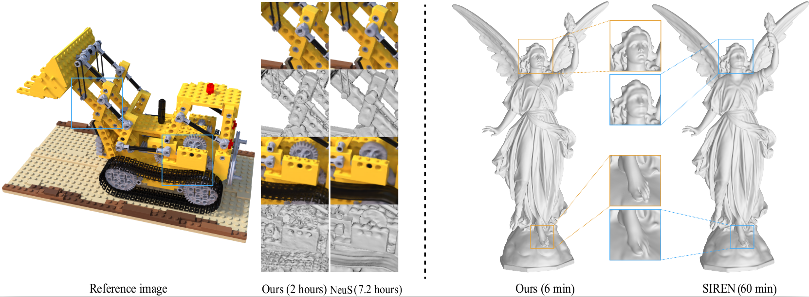

This repository is the implementation of our CVM2023 paper Multi-scale Hash Encoding based Neural Geometry Representation.
Authors: Zhi Deng, Haiyao Xiao, Yining Lang, Hao Feng, Juyong Zhang.
# Neural-Geometry-Reconstruction
Hash Encoding, Point Cloud Reconstruction, Multi-view Reconstruction

